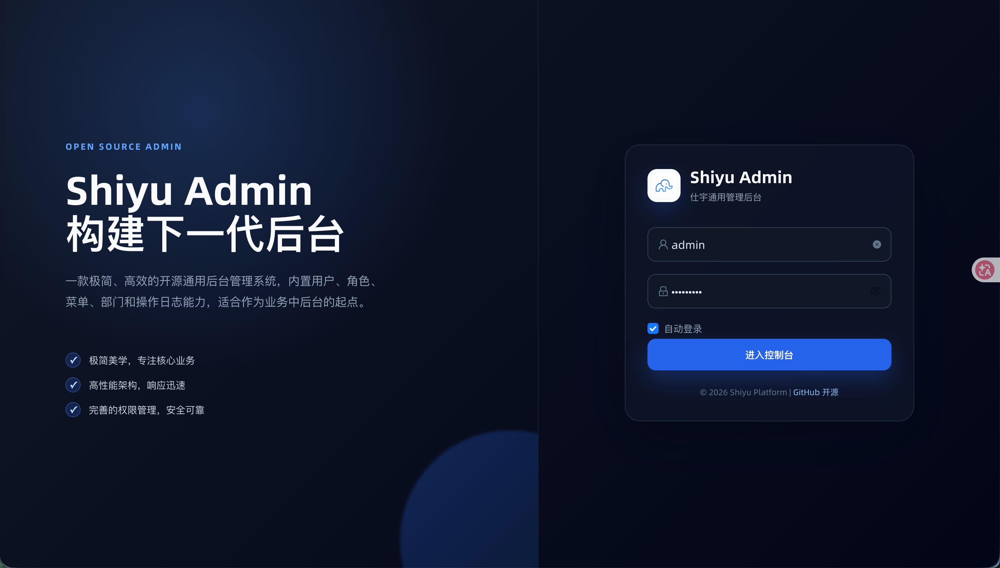
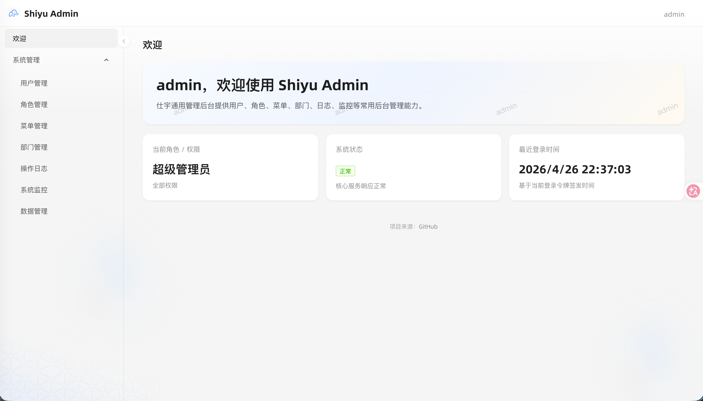
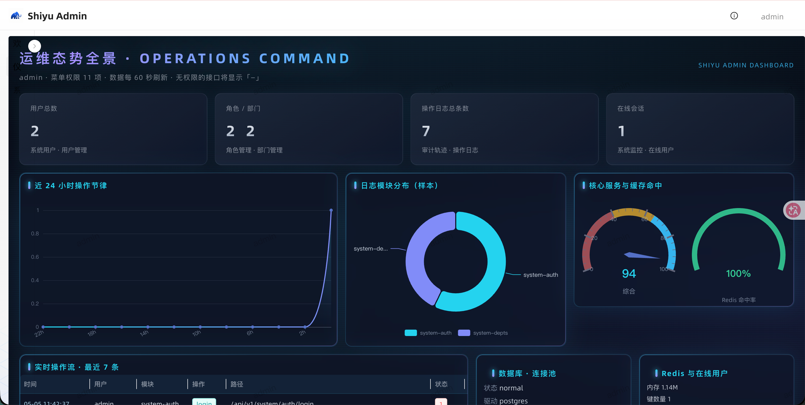

<a id="readme-top"></a>

[![Contributors][contributors-shield]][contributors-url]
[![Forks][forks-shield]][forks-url]
[![Stargazers][stars-shield]][stars-url]
[![Issues][issues-shield]][issues-url]
[![License][license-shield]][license-url]

<br />
<div align="center">
  
  <h1>Shiyu Admin 仕宇通用管理后台</h1>

  <p>
    开源通用后台管理系统 / 后台脚手架<br />
    Go + Gin + Gorm + React + Ant Design Pro + RBAC
  </p>

  <p>
    <a href="https://rodert.github.io/ShiyuAdmin/"><strong>项目主页</strong></a>
    ·
    <a href="#quick-start"><strong>开箱即用</strong></a>
    ·
    <a href="https://github.com/Rodert/ShiyuAdmin/issues/new?labels=bug">反馈 Bug</a>
    ·
    <a href="https://github.com/Rodert/ShiyuAdmin/issues/new?labels=enhancement">功能建议</a>
  </p>


</div>

---

## 项目简介

`Shiyu Admin` 是一个前后端分离的通用后台管理系统，适合快速搭建中后台、学习 RBAC 权限模型，或作为新业务系统的基础脚手架。

- **开箱即用**：Docker Compose 一条命令启动前端、后端、PostgreSQL、Redis。
- **权限完整**：内置用户、角色、菜单、部门、动态菜单和接口权限控制。
- **运维可见**：内置系统监控、数据管理、Redis 缓存管理和操作日志审计。
- **前后端分离**：后端 Go + Gin + Gorm，前端 React + Umi Max + Ant Design Pro。
- **部署友好**：项目介绍页支持 GitHub Pages，服务端可部署到 Docker / Fly.io / Render 等环境。

## 项目主页

- GitHub Pages 项目介绍页：<https://rodert.github.io/ShiyuAdmin/>
- GitHub 主仓库：<https://github.com/Rodert/ShiyuAdmin>
- Gitee 镜像：<https://gitee.com/rodert/ShiyuAdmin>

> 当前不提供在线登录演示。需要体验完整后台，请按“开箱即用”在本地启动。

## 项目预览

### 登录页



### 后台首页



### 数据仪表盘

运维态势看板页面，聚合用户、角色、部门、操作日志与系统监控等数据，支持全屏查看。截图路径：`img/dashboard.png`。



## 开箱即用

<a id="quick-start"></a>

### 方式一：Docker 一键启动

本地只需要安装 Docker 和 Docker Compose。

```bash
git clone https://github.com/Rodert/ShiyuAdmin.git
cd ShiyuAdmin
docker compose up -d
```

启动后访问：

- 前端后台：<http://localhost:8000>
- 后端接口：<http://localhost:8080>
- 健康检查：<http://localhost:8080/api/v1/system/health>

### 方式二：本地开发

后端：

```bash
cd backend/shiyu-admin-backend
go run ./cmd/server
```

前端：

```bash
cd frontend/shiyu-admin-web
npm install
npm run start:dev
```

## 默认账号

| 角色 | 用户名 | 密码 | 权限 |
| --- | --- | --- | --- |
| 管理员 | `admin` | `Admin@123` | 全部菜单和接口权限 |
| 普通用户 | `user` | `User@123` | 欢迎页、仪表盘（无系统管理等配置权限） |

## GitHub Pages 项目主页

项目介绍页放在独立的 `site/` 目录，已配置 GitHub Actions 自动部署到 GitHub Pages，不和后台前端耦合。

1. 进入仓库 `Settings` -> `Pages`。
2. Source 选择 `Deploy from a branch`。
3. Branch 选择 `gh-pages`，目录选择 `/ (root)`。
4. 推送 `main` 分支后，工作流会自动发布 `site/` 静态页。

关键配置：

- Workflow：`.github/workflows/frontend-pages.yml`
- 静态页目录：`site/`
- GitHub Pages 子路径：`/ShiyuAdmin/`

详细说明见：[GitHub Pages 项目主页部署指南](./docs/github-pages-deployment.md)。

## 功能模块

- 系统首页：欢迎语、当前角色 / 权限、系统状态、最近登录时间。
- 仪表盘：运维态势可视化看板（用户、日志、监控等），支持全屏展开；预览图见上方「数据仪表盘」与 `img/dashboard.png`。
- 系统管理：用户管理、角色管理、菜单管理、部门管理。
- 权限控制：JWT 登录认证、RBAC、动态路由、超级管理员权限。
- 系统监控：服务状态、运行信息、数据库状态。
- 数据管理：表结构、字段注释、基础数据查看。
- 缓存管理：查看 Redis 0-15 号库、按 Key / 类型查询缓存，支持 String、List、Set、ZSet、Hash、Stream。
- 操作日志：记录新增、修改、删除等写操作，并记录登录成功和登录失败审计日志。

## 技术栈

| 模块 | 技术 |
| --- | --- |
| 后端 | Go、Gin、Gorm、Viper、JWT |
| 数据库 | PostgreSQL、MySQL、SQLite |
| 缓存 | Redis |
| 前端 | React、Umi Max、Ant Design Pro、TypeScript |
| 部署 | Docker Compose、GitHub Actions、GitHub Pages、Render、Fly.io |

## 项目结构

```text
ShiyuAdmin
├── backend/shiyu-admin-backend     # Go 后端
├── frontend/shiyu-admin-web        # React 前端
├── site                            # GitHub Pages 项目介绍页
├── docs                            # 部署与设计文档
├── img                             # README 预览图
├── docker-compose.yml              # 本地一键启动
└── README.md
```

## 更多文档

- [GitHub Pages 项目主页部署](./docs/github-pages-deployment.md)
- [免费部署指南](./docs/free-deployment.md)
- [Render 部署指南](./docs/render-deployment.md)
- [本地数据库启动指南](./docs/本地数据库启动指南.md)
- [开发时间线](./docs/timeline.md)

## 参与贡献

欢迎提交 Issue 和 PR。适合贡献的方向包括：通用业务模块、权限能力、部署文档、UI 体验、测试用例。

## License

本项目使用 [Apache-2.0](./LICENSE) 开源协议。

## Contact

- 作者：王仕宇（JavaPub）
- 官网：<https://javapub.net.cn/>
- GitHub：<https://github.com/Rodert/ShiyuAdmin>
- 公众号：`JavaPub`

---

[contributors-shield]: https://img.shields.io/github/contributors/Rodert/ShiyuAdmin.svg?style=for-the-badge
[contributors-url]: https://github.com/Rodert/ShiyuAdmin/graphs/contributors
[forks-shield]: https://img.shields.io/github/forks/Rodert/ShiyuAdmin.svg?style=for-the-badge
[forks-url]: https://github.com/Rodert/ShiyuAdmin/network/members
[stars-shield]: https://img.shields.io/github/stars/Rodert/ShiyuAdmin.svg?style=for-the-badge
[stars-url]: https://github.com/Rodert/ShiyuAdmin/stargazers
[issues-shield]: https://img.shields.io/github/issues/Rodert/ShiyuAdmin.svg?style=for-the-badge
[issues-url]: https://github.com/Rodert/ShiyuAdmin/issues
[license-shield]: https://img.shields.io/github/license/Rodert/ShiyuAdmin.svg?style=for-the-badge
[license-url]: LICENSE


  <details>
    <summary>支持一下项目维护</summary>
    <br />
    
  </details>
